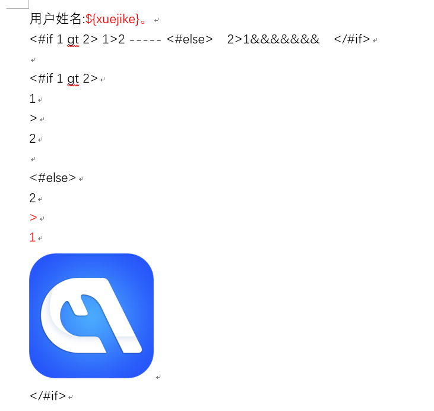
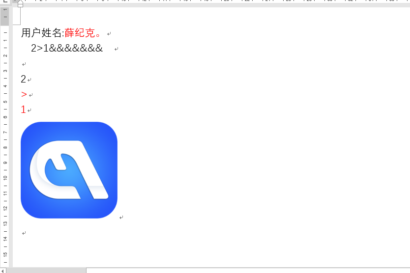

# Word-Tpl Word模板引擎[](https://jitpack.io/#xuejike/word-tpl)

如果只是在word中替换变量，那是我们没用充分利用起word的功能，word-tpl实现了在word中使用我们常用的模板引擎来对word进行内容控制，比如if判断，for循环等，让生成报告更加方便简单。word-tpl中word操作采用POI进行编辑，而不是采用xml生成方式生成的，这样生成的word更加标准。

默认使用的模板引擎是Freemarker，也可以自己扩展替换掉默认的模板引擎。

[TOC]

# 功能说明
* [x] 变量替换
* [x] 段落内条件判断
* [x] 段落间条件判断
* [x] 单元格内条件判断
* [ ] 段落内的for循环（正在开发）
* [ ] 段落间的for循环（正在开发）
* [ ] 表格间的for循环（正在开发）
# 使用效果
## word模板内容

## 转换后的效果

# 使用方式
## 引入类库
```groovy


repositories {
    maven { url 'https://jitpack.io' }

}

dependencies {
    implementation 'com.github.xuejike.word-tpl:word-tpl-core:0.1'
}


```
## 生成word文档
```java
 public class TestMain {
     public static void main(String[] args) throws IOException, TplBuildException {
         String tplFile = "E:\\project\\word-tpl\\word-tpl\\var-tpl.docx";
         String outFile = "E:\\project\\word-tpl\\word-tpl\\var-tpl-out.docx";
 
        HashMap<String, Object> map = new HashMap<>();
        map.put("xuejike","薛纪克");
        //使用Freemarker模板引擎进行解析
        WordTplUtils wordTplUtils = new WordTplUtils(new FreemarkerWordTplFactory());
        // 每次构建都会重新生成word-tpl脚本
        wordTplUtils.buildWord(new File(tplFile),outFile,map);
        // 提前构建脚本，并添加到模板中，以后使用模板名称进行生成word即可，可以避免每次重新构建word脚本
        String script = wordTplUtils.buildTplScript(tplFile);
        wordTplUtils.addTplScript("test",script);
        wordTplUtils.buildWord("test",outFile,map);
     }
 }

```
# 设计思想

# 二次开发
## 引入新的模板引擎

## 标签或者语法的扩展
该类库采用SPI的方式自动加载扩展函数，你也可以手动注册扩展函数。
### 1.编写函数
```java
public class WordRunFunction implements WordTplFunction {
    @Override
    public String getName() {
        //扩展函数的方法名称
        return "wordRun";
    }

    @Override
    public void invoke(WordTpEnvironment environment, Map param, WordTplFunctionBody body) {
    //environment 环境变量，包含模板引擎的变量，运行环境的变量，
    // param 执行方法的参数
    // body 表示代码块的内容区域，如果是单行函数，则为null
        Object index = param.get("index");
        if (index != null){
            environment.setCurrentIndex(WordTpEnvironment.CURRENT_RUN_TAG,index);
        }
        try {
            if (body != null){
                String exec = body.exec();
                //获取当前代码所在的word run对象。
                XWPFRun currentRun = environment.getCurrentRun();
               if (!WordParse.checkHaveTag(exec)){
                   currentRun.setText(exec,0);
               }
            }

        } catch (Exception e) {
           throw new RuntimeException(e);
        }
    }
}

```
### 2.注册函数
1. 采用方法注册
```java
        FreemarkerWordTplFactory tplFactory = new FreemarkerWordTplFactory();
        tplFactory.registerFunction(new WordRunFunction());
```
2. 采用SPI注册
在jar包中新建文件 /META-INF/services/com.github.xuejike.wordtpl.tpl.WordTplFunction

文件内容填写需要扩展的类全路径
```text
com.github.xuejike.wordtpl.tpl.functions.WordRunFunction
```
### 3.使用函数
由于我采用的是Freemarker模板引擎，那么使用方法就是使用freemarker自定义指令的方式。
```ftl
<@wordRun index ="1">sssss</@wordRun>
```
